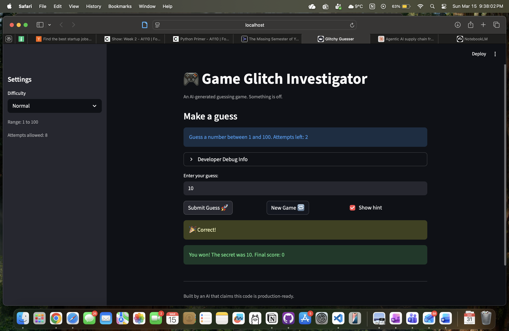

# 🎮 Game Glitch Investigator: The Impossible Guesser

## 🚨 The Situation

You asked an AI to build a simple "Number Guessing Game" using Streamlit.
It wrote the code, ran away, and now the game is unplayable. 

- You can't win.
- The hints lie to you.
- The secret number seems to have commitment issues.

## 🛠️ Setup

1. Install dependencies: `pip install -r requirements.txt`
2. Run the broken app: `python -m streamlit run app.py`

## 🕵️‍♂️ Your Mission

1. **Play the game.** Open the "Developer Debug Info" tab in the app to see the secret number. Try to win.
2. **Find the State Bug.** Why does the secret number change every time you click "Submit"? Ask ChatGPT: *"How do I keep a variable from resetting in Streamlit when I click a button?"*
3. **Fix the Logic.** The hints ("Higher/Lower") are wrong. Fix them.
4. **Refactor & Test.** - Move the logic into `logic_utils.py`.
   - Run `pytest` in your terminal.
   - Keep fixing until all tests pass!

## 📝 Document Your Experience

- [✅] Describe the game's purpose.
   This purpose is a number guessing game where the player tries to guess a secret number within a limited number of attempts, receiving higher/lower hints after each guess and earning points based on how quickly they win.

- [✅] Detail which bugs you found.
   1. The hints were inverted where the "Go HIGHER" appeared when the guess was too high, and vice versa, which was caused by swapped emoji strings and type corruption (secret was cast to `str` on even attempts).
   2. New Game did not reset `status`, so the game stayed stuck in "won"/"lost" after a round ended.
   3. New Game always generated the secret from 1–100, ignoring the selected difficulty range.
   4. New Game did not reset `score` or `history`, carrying them over into the next round.
   5. The initial attempts counter started at 1 instead of 0, skewing the score and attempts display.

- [✅] Explain what fixes you applied.
   1. Removed the type corruption (`str(secret)`) and fixed the hint messages in `check_guess` to display the right directions for teh guesses.
   2. Added `st.session_state.status = "playing"` to the New Game block.
   3. Changed `random.randint(1, 100)` to `random.randint(low, high)` using the difficulty range.
   4. Added resets for `score` and `history` in the New Game block.
   5. Changed the initial attempts value from `1` to `0`.
   6. Refactored all core logic functions into `logic_utils.py` and updated imports in `app.py`.

## 📸 Demo

- [✅] [Insert a screenshot of your fixed, winning game here]

 

## 🚀 Stretch Features

- [ ] [If you choose to complete Challenge 4, insert a screenshot of your Enhanced Game UI here]
